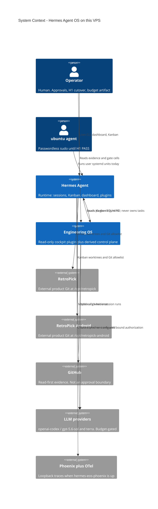
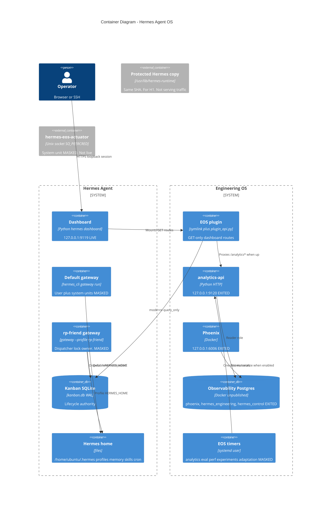
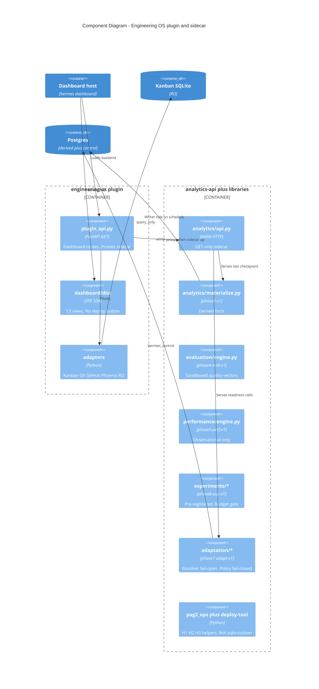
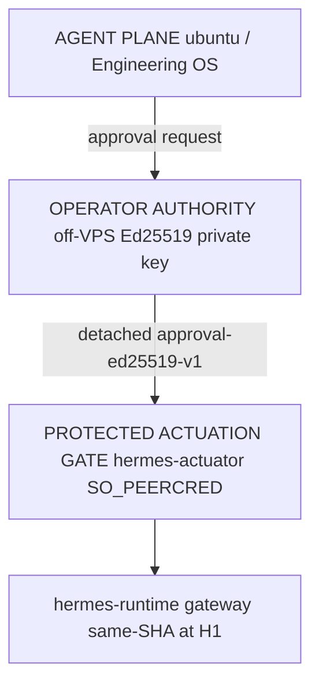
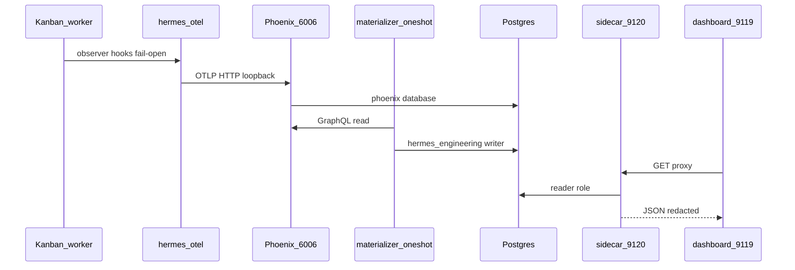
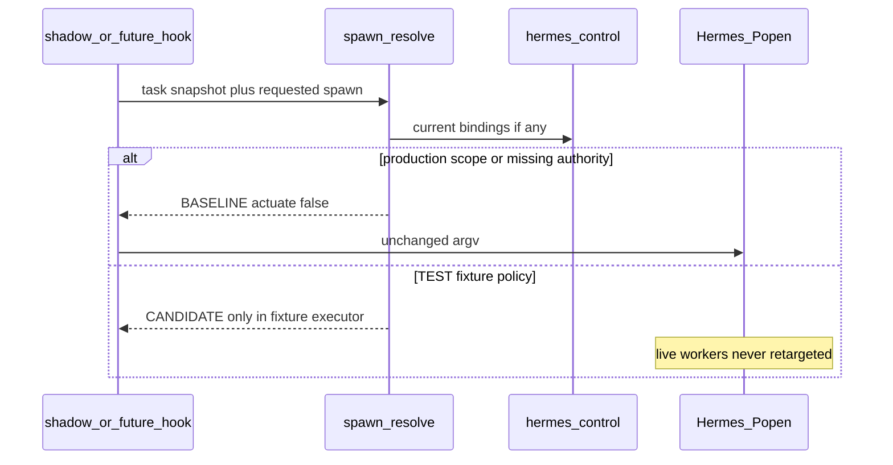
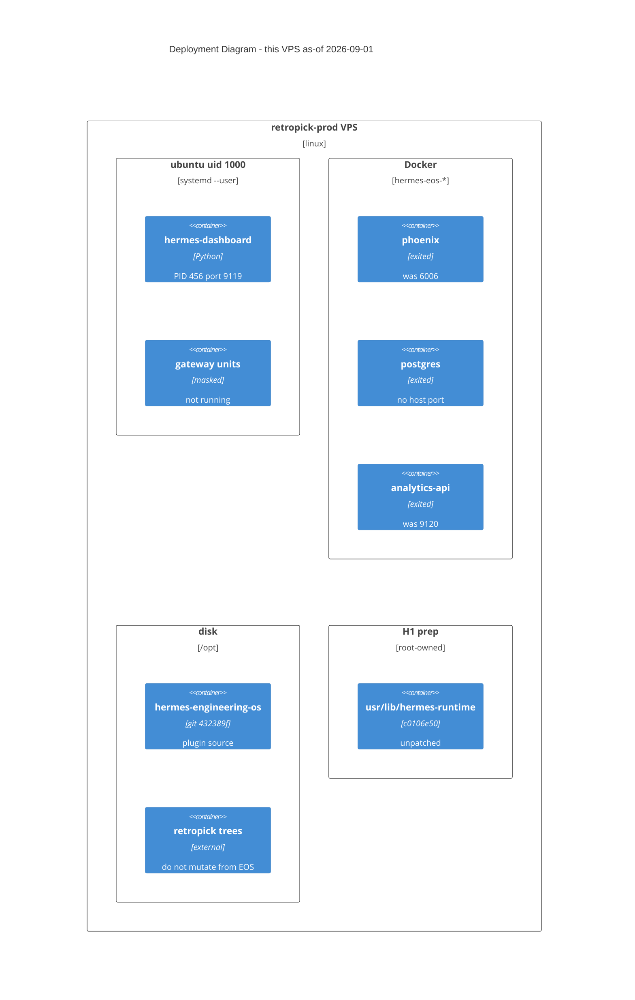

# Hermes Agent OS — Canonical Overview

**As of:** 2026-09-01T14:13:42Z  
**Evidence:** [tests/evidence/platform-overview-20260901T141342Z.json](../tests/evidence/platform-overview-20260901T141342Z.json)  
**Refresh:** `scripts/capture-platform-overview.sh`, then `scripts/pag2-status.sh` and `scripts/verify-operator-boundary.sh`

**Banner:** production adaptation is **DISABLED**. Live Hermes spawn-transform is **NOT_DEPLOYED**. Do not collapse independent cells into one green status.

This file is the all-in-one picture of **this VPS**: Hermes Agent runtime plus Engineering OS. Phase reports, PAR, and PAG docs remain dated evidence. They are not rewritten here.

Two tracks run through every section:

- **Qualified / intended** — what Phases 1–7, PAR, PAG-1, and PAG-2 autonomous work built and verified.
- **Live now** — what is actually running at the as-of stamp. It has drifted: dashboard up; gateways masked; EOS containers exited.

## How to read this file vs the rest of the tree

| Need | Go here |
|---|---|
| Whole system in one pass | this file |
| ASCII pipeline summary | [ARCHITECTURE.md](../ARCHITECTURE.md) |
| Ports, timers, backups | [OPERATIONS.md](../OPERATIONS.md) |
| Commands | [RUNBOOK.md](../RUNBOOK.md) |
| Agent stop-lines | [AGENTS.md](../AGENTS.md) |
| Security model | [SECURITY.md](../SECURITY.md) |
| Why a choice was made | [DECISIONS.md](../DECISIONS.md) |
| Metric dictionaries / schemas | `docs/METRIC_DICTIONARY.md`, `docs/*_DATABASE.md`, Gate X.1 matrices |
| Dated gate results | `PHASE*_REPORT.md`, `PRODUCTION_READINESS_REPORT.md`, `PAG1_REPORT.md`, `PAG2_REPORT.md` |

Do not copy metric IDs into this file. Point at the dictionary.

---

## 1. 5W+1H

**Who.** A human operator. The `ubuntu` agent plane (uid 1000). Planned after H1: `hermes-op` (human admin), `hermes-runtime` (gateway identity), `hermes-actuator` (protected IPC). Hermes Kanban workers under specialist `rp-*` profiles. RetroPick (web + Android) is an **external** product this agent works on; it is not inside Engineering OS.

**What.** Hermes Agent is the runtime: sessions, CLI/TUI, dashboard, Kanban, profiles, memory, skills, cron, plugins, optional messaging gateways. Engineering OS is a **read-only cockpit plugin**: adapters, GET-only APIs, derived analytics/eval/perf/experiments, and a fail-closed adaptation control plane that must not become a second orchestrator.

**Where.** This VPS. Loopback only for operator surfaces: dashboard `127.0.0.1:9119`, sidecar `:9120` (when the analytics container is up), Phoenix `:6006` (when up). Observability Postgres has no host port. Product code: `/opt/hermes-engineering-os`. Hermes home: `/home/ubuntu/.hermes`. Live Hermes source: `/home/ubuntu/.hermes/hermes-agent` at `c0106e50`.

**When.** Phase 1–7 **framework COMPLETE**. PAR and PAG-1 **framework COMPLETE**. PAG-2 autonomous hardening exists; H1 is **READY_FOR_HUMAN**, not PASS. H3 is not deployed. At this stamp, gateways and EOS timers are **masked**, and `hermes-eos-*` containers are **exited**.

**Why.** Operators need evidence (what ran, what passed, what a candidate policy would do) without giving Engineering OS task ownership. Kanban stays the only lifecycle authority. Production model routing stays off until human gates H1 → H2 (budget/experiment) → H3 (hash-locked seam) plus Approval A.

**How.** Plugin symlink into Hermes. Dashboard FastAPI GET routes. Sidecar GET `:9120` for derived layers. hermes-otel observer hooks, fail-open if Phoenix is down. Adaptation resolver is a library: fail-open to Hermes baseline, fail-closed for candidate policy. Spawn identity changes require a Hermes-core hook that is qualified in isolation and **not** applied live.

---

## 2. C4 — System context

Engineering OS is one software system. Hermes Agent is the other. They share a host and a plugin load, but Kanban remains Hermes-owned.

Out of scope for this C4: RetroPick market APIs, Android Compose screens, NousResearch upstream website.

---

## 3. C4 — Containers

A **container** here is a deployable process, data store, or plugin boundary — not a Docker-only term. Docker is one way some containers run.

### Container catalog (qualified vs live)

| Container | Purpose | Owner / tech | Port / path | Live at stamp |
|---|---|---|---|---|
| Dashboard | Operator UI + plugin host | `ubuntu` user unit `hermes-dashboard.service` | `127.0.0.1:9119` | **active**, PID **456** |
| Default gateway | Messaging + default home | intended: user unit, later `hermes-runtime` | none on host | **masked** (user and system) |
| rp-friend gateway | Isolated profile; **singleton dispatcher lock** | intended: `--profile rp-friend` | none on host | **masked** (user and system) |
| Kanban SQLite | Task lifecycle | Hermes | `~/.hermes/kanban.db` | files present; no dispatcher process |
| EOS plugin | Read-only cockpit | symlink | `~/.hermes/plugins/engineering-os` → `/opt/hermes-engineering-os` | **linked** |
| analytics-api | GET `/analytics*` `/evaluations*` `/performance*` `/experiments*` `/adaptation*` | Docker `hermes-eos-analytics-api` bind-mount `/opt/hermes-engineering-os:/app:ro` | `127.0.0.1:9120` | **exited** |
| Phoenix | OTel sink + UI | Docker `hermes-eos-phoenix` | `127.0.0.1:6006` | **exited** |
| Postgres | phoenix / `hermes_engineering` / `hermes_control` | Docker `hermes-eos-postgres` | no host port | **exited** |
| EOS timers | Derived refresh | user systemd timers | n/a | **masked** |
| Protected runtime copy | H1 same-SHA tree | `/usr/lib/hermes-runtime` | n/a | present; spawn hook **ABSENT** |
| Actuator | Hash-locked IPC for spawn transform | `hermes-eos-actuator.service` | `/run/hermes-eos/actuator.sock` | **masked** |

Templates for post-H1 system units live in [deploy/pag2/](../deploy/pag2/). They are not the live serving path until H1 cutover and H3 install.

### Dual-gateway rule

Hermes allows multiple gateways. Only one may own Kanban dispatch (`kanban.dispatch_in_gateway`). On this machine the intended owner is **rp-friend**. Default gateway must not steal the lock. See live Hermes [docs/kanban/multi-gateway.md](/home/ubuntu/.hermes/hermes-agent/docs/kanban/multi-gateway.md) and [AGENTS.md](../AGENTS.md).

---

## 4. C4 — Components (Engineering OS)

Dashboard views (host React via `window.__HERMES_PLUGIN_SDK__`): Overview, Tasks, Runs, Agents, Plugins, GitHub, Workspaces, Observability, Analytics, Evaluations, Performance, Experiments, Adaptation.

---

## 5. C4 — Code index

Not a class diagram. Modules and jobs:

| Path | Job |
|---|---|
| `engineering_os/adapters` usage via dashboard + `analytics/adapters.py` | Read Kanban/Git/GitHub/Phoenix |
| `engineering_os/redaction.py` | Recursive secret-key redaction |
| `engineering_os/observability/*` | Correlation stamp, Phoenix health |
| `engineering_os/analytics/*` | phase3-v1 materialize, quality, GET |
| `engineering_os/evaluation/*` | Sandbox, profiles, quality vectors. LLM judge off |
| `engineering_os/performance/*` | Observational cohorts. No ranking as causality |
| `engineering_os/experiments/*` | Protocols, assignment, budget_gate, real_executor |
| `engineering_os/adaptation/*` | Recommend, compile, shadow, canary, rollback, spawn_resolve |
| `engineering_os/adaptation/ipc_client.py` | OS-timeout client for actuator |
| `scripts/hermes-eos-deploy-tool.py` | Hash-locked install/rollback. ubuntu cannot apply |
| `scripts/verify.sh` | Full acceptance including PAG-1/PAG-2 checks |
| `scripts/pag2-*.sh`, `scripts/h1-*.sh`, `scripts/h2-*.sh`, `scripts/h3-*.sh` | Human-gated operators |
| `deploy/pag2/*` | Unit, sudoers, actuator.env, eos-actuation plugin templates |
| `patches/hermes/*` | Historical PAR patch + upstream/live spawn-transform patches. Not live |

---

## 6. Hermes Agent product capabilities (this install)

Source: `/home/ubuntu/.hermes` and `/home/ubuntu/.hermes/hermes-agent` at `c0106e50`. This is not the upstream marketing README.

| Capability | Config / files | Live |
|---|---|---|
| CLI / TUI | `hermes` on PATH, venv in hermes-agent | available |
| Web dashboard | `hermes dashboard --host 127.0.0.1 --port 9119` | **running** |
| Kanban | `config.yaml` kanban: orchestrator `rp-release-orchestrator`, max_in_progress 2, per-profile 1, review_dispatch true | DB present; dispatcher **not running** |
| Profiles | 10: `rp-android`, `rp-api-contract`, `rp-backend-markets`, `rp-friend`, `rp-qa-e2e`, `rp-recovery-architect`, `rp-release-orchestrator`, `rp-review-security`, `rp-sre-release`, `rp-web` | present |
| Memory | `memory.memory_enabled: true`, `user_profile_enabled: true` | on |
| Skills | 22 skill dirs under `~/.hermes/skills/` (plus `.hub` / backups) | present |
| Cron | 2 enabled jobs: reconcile watch every 360m (`no_agent`), wave orchestrator every 120m | files present; depends on agent/cron runner |
| MCP | `codebase-memory-mcp` | configured |
| Plugins | `engineering-os`, `hermes_otel`, `superpowers`. `engineering-os.allow_tool_override: false` | enabled in config |
| Default model | `gpt-5.6-sol` / `openai-codex` | configured; no session claimed here |
| Approvals | `approvals.mode` off | off |
| Shared telemetry | `telemetry.shared_metrics.enabled: false` | off |
| Live spawn-transform | `transform_kanban_worker_spawn` | **ABSENT** in live `kanban_db.py` / `plugins.py` |
| Production adaptation | Phase 7 actuation | **DISABLED** |

Cron jobs work RetroPick **release factory** scripts. They do not grant Engineering OS Kanban write.

---

## 7. Consolidated capability matrix

Ratings are **independent**. A READY harness is not production routing.

| Layer | Contract | What it can do | Production actuation | Live API at stamp |
|---|---|---|---|---|
| Plugin / Phase 1 | dashboard plugin | Read Hermes/Kanban/Git/GitHub | n/a (read-only) | dashboard 200; GitHub historically BLOCKED_AUTH in early reports |
| Observability / Phase 2 | hermes-otel → Phoenix | Traces, correlation namespaces | n/a | Phoenix **down** (container exited) → observability **DEGRADED** if queried |
| Analytics / Phase 3 | `phase3-v1` | Derived facts, UNKNOWN allowed | n/a | sidecar **down** |
| Evaluation / Phase 4 | `phase4-eval-v1` | Sandboxed vectors. No live LLM judge | n/a | sidecar **down** |
| Performance / Phase 5 | `phase5-perf-v1` | Observational cohorts. Not causal | n/a | sidecar **down** |
| Experiments / Phase 6 | `phase6-exp-v1` | Fixture qualification; real protocol frozen | no auto-route | sidecar **down**; budget artifact **present** (v2 status AUTHORIZED per pag2-status); experiment label **NOT_STARTED** |
| Adaptation / Phase 7 | `phase7-adapt-v1` | Fixture shadow/canary in control DB; GET readiness | **DISABLED** | sidecar **down** |
| PAR | `par-v1` | Independent cells; Ed25519 scaffolding | DISABLED | cells defined in code; live GET needs sidecar |
| PAG-1 | `pag1-v1` | Boundary verifier; upstream patch; preflight | DISABLED | verifier **READY_FOR_HUMAN** |
| PAG-2 | four-principal TCB | H1 templates, H2 runner, H3 deploy-tool | DISABLED until gates | H1 **READY_FOR_HUMAN**; H3 **false** |

Detail matrices (do not duplicate):

- [docs/ANALYTICS_SOURCE_CAPABILITIES.md](ANALYTICS_SOURCE_CAPABILITIES.md)
- [docs/EVALUATION_CAPABILITY_MATRIX.md](EVALUATION_CAPABILITY_MATRIX.md)
- [docs/PERFORMANCE_SOURCE_CAPABILITIES.md](PERFORMANCE_SOURCE_CAPABILITIES.md)
- [docs/EXPERIMENT_CAPABILITY_MATRIX.md](EXPERIMENT_CAPABILITY_MATRIX.md)
- [docs/ADAPTATION_CAPABILITY_MATRIX.md](ADAPTATION_CAPABILITY_MATRIX.md)
- [docs/PLUGIN_VERIFICATION_MATRIX.md](PLUGIN_VERIFICATION_MATRIX.md)

Treatment dimensions vs live seam (from adaptation matrix): MODEL / PROFILE / SKILL remain **BLOCKED_RUNTIME_INTEGRATION** on live Hermes until H3 deploys the spawn-transform. Writing Kanban `model_override` to route traffic is forbidden (that would make EOS a pre-dispatch controller).

### Named GET cells

Sidecar (when up): `GET /adaptation/readiness` and `/adaptation/readiness/{authority,runtime,memory,evidence,canary,pag2,experiment,upstream}`. Dashboard plugin proxies the same names under `/api/plugins/engineering-os/`. POST stays 405.

Code defaults in `engineering_os/adaptation/__init__.py` (not a live HTTP read while sidecar is down):

| Cell | Constant default |
|---|---|
| production_adaptation | DISABLED |
| secure_human_authority | READY_FOR_OPERATOR_BOOTSTRAP |
| runtime_actuation | READY_PATCH_NOT_DEPLOYED |
| upstream_actuation | READY_FOR_UPSTREAM_SUBMISSION |
| memory_isolation | READY |
| real_experiment | READY_FOR_BUDGET_AUTHORIZATION |
| real_causal_evidence | BLOCKED_BUDGET |
| pag2_readiness | BLOCKED_EVIDENCE_AND_AUTHORITY |
| approval_a | BLOCKED_SECURITY_BOUNDARY |
| production_shadow / canary_package | BLOCKED_EVIDENCE |

`pag2-status.sh` at this stamp reported `budget=AUTHORIZED` for protocol `real-model-sol-vs-terra-v2` because a bound artifact exists. That does not execute the experiment and does not flip `pag2_label` off `NOT_STARTED`. Next action remains H1.

### Frozen real protocols

| Protocol | Role | Notes |
|---|---|---|
| `real-model-sol-vs-terra-v1` | PAG-1 pilot | hash `92bd21f095784998d4304bfa016c254cdf7b04e38aeb929132860cf40a771cdf`; 5 pairs / 10 units; PILOT_ONLY after v2 freeze |
| `real-model-sol-vs-terra-v2` | PAG-2 confirmatory | 28 pairs / 56 units; hash in PAG-2 report `fa1b83d8583f832ac8ed15f456f12f9856aca1b26689d8859f1d6e5a7e3a870a`; execution **NOT_STARTED** |

Primary metric stays `phase4.quality_vector.tests`. Do not change it after outcomes exist. Workspaces are copies under experiment runtime, never RetroPick trees. Memory isolation: `memory-snapshot-v1` harness, not production AgentMemory/Graphiti.

---

## 8. Authority, security, fail-open

**Today (not H1 PASS).** `ubuntu` still has `NOPASSWD: ALL`. Principals `hermes-op`, `hermes-runtime`, `hermes-actuator` **exist**, and some trust/unit files exist, but `scripts/verify-operator-boundary.sh` returns **READY_FOR_HUMAN**. Reasons at stamp include `AUTH_AGENT_PASSWORDLESS_ROOT`, `AUTH_AGENT_IN_DOCKER_GROUP`, writable trust/unit paths, `AUTH_VERIFIER_CODE_WRITABLE`, `AUTH_GITHUB_ADMIN_ON_AGENT`, and `AUTH_GATEWAY_RUNS_AS_AGENT` (gateways are not running as `hermes-runtime`; they are masked).

PASS requires: ubuntu cannot gain unrestricted root; cannot replace verifier/trust/actuator; cannot impersonate the operator. Passwordless sudo makes PASS impossible. Human-only steps: [docs/OPERATOR_BOOTSTRAP.md](OPERATOR_BOOTSTRAP.md). Architecture options: [docs/OPERATOR_AUTHORITY_ARCHITECTURE.md](OPERATOR_AUTHORITY_ARCHITECTURE.md).

### Four principals (intended after H1 PASS)

| Principal | uid at stamp | Job |
|---|---|---|
| `ubuntu` | 1000 | Agent plane. Must lose `NOPASSWD: ALL` after new admin is proven |
| `hermes-op` | 1001 | Human administrator. Holds sudo for hash-locked deploy |
| `hermes-runtime` | 999 | Runs gateways. Home `/var/lib/hermes-runtime` (not readable by this capture) |
| `hermes-actuator` | 997 | Socket peer for spawn-transform IPC. ubuntu must not write its unit after H1 |

Accounts exist. Cutover (mask ubuntu gateways, start system units as `hermes-runtime`, reduce ubuntu sudo) is **not** done. Do not run `scripts/h1-cutover.sh` as ubuntu; it refuses that caller.

**Fail-open Hermes.** Sidecar down → Hermes `/health` and dashboard stay up; derived views DEGRADED. Plugin hooks must not crash workers.

**Fail-closed adaptation.** Missing cache, bad approval, conflict, kill switch, production scope → **BASELINE**, `actuate=false`. TEST HMAC cannot authorize `PRODUCTION_*`. POST `/adaptation` is 405 when the sidecar is up.

**Redaction.** Keys matching token/secret/password/authorization/cookie/credential are redacted, with an allowlist so public cells like `budget_authorization` remain visible.

**GitHub** is evidence, not an approval boundary. Admin `gh` on an unprotected repo is recorded as a reason code, not as READY authority.

### Evidence states (plugin reads)

| State | Meaning |
|---|---|
| AVAILABLE | Authoritative read completed |
| DEGRADED | Source failed or timed out; Hermes continues |
| UNKNOWN | Correlation evidence absent (not coerced to false) |
| BLOCKED_AUTH | GitHub API unavailable |
| DISABLED / BLOCKED_* / READY_FOR_* | Adaptation cells; never collapse to a single READY |

Full command lists: [RUNBOOK.md](../RUNBOOK.md).

---

## 9. Data and control flow

### 9.1 Evidence path (qualified)

When Phoenix or Postgres is down, this path stops at DEGRADED. It does not stop Hermes sessions.

### 9.2 Adaptation resolve (always fail-open to baseline)

Live `_default_spawn` still builds argv and `Popen` with **no** `transform_kanban_worker_spawn`. Isolated patches:

- Historical PAR: `patches/hermes/0001-pre-worker-spawn-hook.patch`
- PAG-1 upstream: `patches/hermes/upstream/0001-worker-spawn-transform.patch`
- PAG-2 live-SHA variant: under `patches/hermes/live/` (qualified, not applied)

---

## 10. Production gates (honest)

| Gate | Qualified meaning | Live at stamp |
|---|---|---|
| Phase 1–7 framework | COMPLETE (historical reports) | Code is in tree; timers/containers **not running** |
| PAR | Framework COMPLETE; production DISABLED | still DISABLED |
| PAG-1 | Framework COMPLETE | still complete; live patch still NO |
| PAG-2 H1 | Four-principal same-SHA cutover | **READY_FOR_HUMAN** — principals exist; ubuntu still passwordless root; gateways masked not cut over |
| PAG-2 H2 | Bound LLM budget + confirmatory experiment | `pag2-status` `budget=AUTHORIZED`; `pag2_label=NOT_STARTED`; next still **H1** |
| PAG-2 H3 | Hash-locked spawn-transform on protected runtime | `h3=false`; live_spawn_hook **ABSENT**; protected_spawn_hook **ABSENT** |
| Real causal evidence | QUALIFIED only after executed confirmatory run | **not started** (do not treat fixture Phase 6 as production proof) |
| Production shadow | After evidence + Approval A semantics | BLOCKED |
| One-task canary | After H3 + Approval A | BLOCKED |
| Production adaptation | DISABLED until the whole chain | **DISABLED** |
| Production exposures | 0 PRODUCTION bundles/approvals | not re-queried (Postgres exited); last qualification was 0 |
| Auto-promote | forbidden | `auto_promote=false` |

Dated write-ups: [PAG1_REPORT.md](../PAG1_REPORT.md), [PAG2_REPORT.md](../PAG2_REPORT.md), [PRODUCTION_READINESS_REPORT.md](../PRODUCTION_READINESS_REPORT.md). Prefer `scripts/pag2-status.sh` over PIDs copied from August.

Human sequence after H1 PASS: `scripts/h2-present-budget.sh` → authorized `run-real` → `analyze-real` → H3 deploy-tool as `hermes-op` → Approval A → canary scripts. ubuntu must not self-authorize by inventing a budget file during autonomous work; a file may already exist from a human. This overview does not print that file.

---

## 11. Operations index

| Surface | Bind | Notes |
|---|---|---|
| Dashboard + EOS plugin | `127.0.0.1:9119` | session cookie/token; GET plugin APIs |
| Analytics sidecar | `127.0.0.1:9120` | down when container exited |
| Phoenix UI / OTLP | `127.0.0.1:6006` | down when container exited |
| Postgres | unpublished | never publish host port |
| Gateways | no extra ports documented here | Telegram/etc. inside Hermes gateway when unmasked |

Verify: `./scripts/verify.sh`  
Install plugin: `./scripts/install-plugin.sh` then dashboard-only restart  
Never restart a gateway to “qualify” a doc.

Backups: `/var/backups/hermes-engineering-os/observability-*`. Restore only via isolated `scripts/observability-db-verify.sh`, never onto live Postgres.

Capacity at this stamp: root **894.33 GiB** free, **6.1%** used (this host is not the August 21 GiB disk snapshot).

---

## 12. C4 — Deployment (this VPS)

Quarantined former user units (not loaded): `~/.config/systemd/user/quarantined-m11-2/` per live survey. Do not unmask from this document.

---

## 13. Report lineage and freshness

| Document | What it proved | Stale if you treat it as now |
|---|---|---|
| `README.md` (before this work) | Phase 1 plugin | omitted Phases 2–7 / PAG |
| `PHASE1_REPORT.md` … `PHASE7_REPORT.md` | Framework at each close | dashboard PIDs, “not pushed”, GitHub BLOCKED_AUTH |
| `PRODUCTION_READINESS_REPORT.md` | PAR cells | “Do not push”; later commits exist |
| `PAG1_REPORT.md` | PAG-1 EXAMPLE A | “Do not begin PAG-2”; PAG-2 tree exists; PIDs 924 / 2381797 |
| `PAG2_REPORT.md` | PAG-2 autonomous work | header “not pushed”; origin is now at `432389f` |
| `docs/PAG2_PROPOSED_PLAN.md` | early plan | says not started |
| `docs/PHASE4–7_PROPOSED_PLAN.md` | early plans | contradict COMPLETE reports |

**Live source of truth:** capture script + `pag2-status.sh` + `verify-operator-boundary.sh` + systemd/docker/HTTP. Historical reports stay as audit trail.

---

## 14. Extension rules (so new work does not fork the OS)

- New evidence belongs in a derived layer (analytics/eval/perf/experiments) or a GET cell — not a second scheduler.
- New actuation belongs behind H1 identity + hash-locked deploy-tool + spawn-transform. Not Kanban PATCH.
- New docs that are phase-specific stay under `docs/`. Change **this file** only when the system boundary, containers, or live-vs-intended story changes.
- `scripts/verify.sh` remains the acceptance command.

Decision log (do not duplicate): [DECISIONS.md](../DECISIONS.md). Threat model: [docs/PRODUCTION_AUTHORITY_THREAT_MODEL.md](PRODUCTION_AUTHORITY_THREAT_MODEL.md).

---

## Appendix A — Live snapshot (2026-09-01T14:13:42Z)

| Item | Value |
|---|---|
| EOS HEAD | `432389ff3eb8d50fcf9d87d71f103358e2a4e6f8` `feat: add PAG-2 H1-H3 operator scripts and hardened qualification` |
| origin/main | same SHA; working tree clean at capture of git identity (this doc is a later working-tree add) |
| Live Hermes HEAD | `c0106e50e7ecedb3ce34e785d949725dc4e0e457` dirty: `package-lock.json` only |
| Live spawn hook | ABSENT |
| Protected copy SHA | `c0106e50e7ecedb3ce34e785d949725dc4e0e457` hook ABSENT |
| RetroPick | `a8edf7dd3e7195aea6f1c826fcf2199ead525162` |
| Android | `e962490dab3ac1072d9ee6371eb1077c0a05c0ac` |
| Dashboard | active PID **456** HTTP **200** |
| Sidecar `:9120` | connection error (container exited) |
| Phoenix `:6006` | connection error (container exited) |
| Gateways | user+system **masked** |
| EOS timers | user **masked** |
| Actuator | system **masked** |
| Docker | `hermes-eos-analytics-api`, `hermes-eos-postgres`, `hermes-eos-phoenix` **Exited (255)** |
| Plugin symlink | valid → `/opt/hermes-engineering-os` |
| pag2-status | `h1=READY_FOR_HUMAN` `h3=false` `pag2_label=NOT_STARTED` `budget=AUTHORIZED` `next=HUMAN ACTION REQUIRED — H1` |
| Boundary | `READY_FOR_HUMAN` (see reasons above) |
| Budget file present | yes (contents not printed) |
| Disk | 894.33 GiB free, 6.1% used |

Regenerate: `./scripts/capture-platform-overview.sh`

---

## Appendix B — Skills used to write this file

| Skill | Source | Use |
|---|---|---|
| find-skills | skills.sh | Located architecture/C4/writing skills |
| architecture-blueprint-generator | github/awesome-copilot, 11.9K installs | Blueprint sections: layers, data, security, extension |
| c4-architecture | softaworks/agent-toolkit, 4.1K installs | C4Context / C4Container / C4Component / C4Dynamic-equivalent sequences / C4Deployment |
| writing-for-agents | mattpocock/skills, 180.5K installs | Pointers instead of duplicating dictionaries; one source of truth |
| humanizer | already installed | 5W+1H without sales language |
| C4 model | https://c4model.com/ | Level meanings |

Low-install C4 clones were not used.

---

## Appendix C — What this OS will not do

- Own Kanban writes, retries, or a second task database
- Auto-promote a candidate model into production
- Treat fixture A/A or known-effect results as production causal proof
- Deploy spawn-transform because a patch file exists
- Use production shadow as a shortcut around real evidence
- Restart rp-friend or the default gateway to make a report look healthier
- Mutate `/opt/retropick` or `/opt/retropick-android` from Engineering OS
